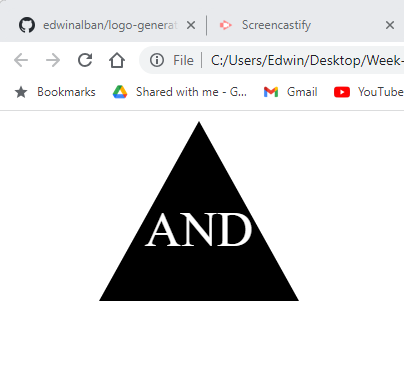

# Logo Generator
Generates a simple logo based on user input.

## Description

I built this project in order to practice using a parent class and subclasses in order to generate files based on user input. It solves the problem of having to create a new SVG file from scratch for each new iteration of the template file, as the classes serve to construct a new SVG file each time the application is invoked by typing "node index.js" in the command line. I learned about classes, inheritance (subclasses from their parent), testing code via jest, and how to organize multiple files to work together while still being intuitive for another developer to interpret quickly.

## Table of Contents

- [Installation](#installation)
- [Usage](#usage)
- [Tests](#tests)

## Installation

You will need to install Node.js, Inquirer, and Jest in order to use this app. 

Instructions for installating Node.js can be found here: https://coding-boot-camp.github.io/full-stack/nodejs/how-to-install-nodejs 

Instructions for installing the Inquirer package can be found here: https://www.npmjs.com/package/inquirer/v/8.2.4

Instructions for installing the Jest package can be found here: https://www.npmjs.com/package/jest

## Usage

In order to generate a new SVG file, all you will need to do is type "node index.js" into your terminal and answer the prompts.

A link to the video to showcase the functionality of the app is below.

https://drive.google.com/file/d/1eDXTam1Ha-ooh4hpWp8tmGtoo0DM06_-/view

## Tests

This project can be tested by answering the prompts with different answers. You will then see that a new SVG file has been generated based on the new answers.

